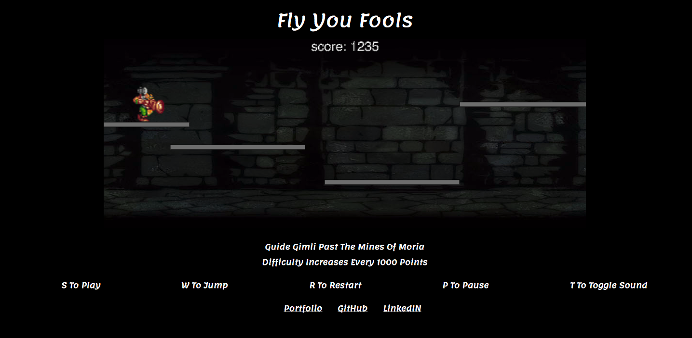

# "Fly You Fools"

["Fly You Fools" Live](http://johnbaek.life/FlyYouFools)


# What is "Fly You Fools"?
"Fly You Fools" is a "Lord Of The Rings" inspired platform runner game which was crafted utilizing Canvas, JavaScript, jQuery, HTML, and CSS.
The game also makes use of Google's Firebase in order to keep track of scores from players all over the world.

# How do you play "Fly You Fools"?

After the user initializes the game by entering their name and hitting the "S" key to start the game, the user must then use the "W" key to make Gimli jump and land on the passing platforms. The longer Gimli stays alive, the higher a user's score. Watch out though! Gimli has only one life and the speed of the platforms increases every 1000 points.



Additional capabilities include pressing "T" to toggle the soundtrack, "R" to restart the game on game over, and "P" key to pause the game.
Top scores can be seen once the game is over. Happy playing!

# Gimli's update function

Gimli has an update function which is constantly running to check for platform collision and that the Gimli sprite remains within sight at all times. The function is designed to also determine when the game is over. Should Gimli's Y position become higher than the canvas height of 400, the state of the game changes from "gameOn" to "gameOver".

```javascript
update(){
  this.checkPlatformCollision();
  this.frames++;
  if (this.frames > 5) {
    this.idle = true;
  }

  if (this.idle){
    this.gimli.spriteIdleCounter += 0.05;
  }

  this.gimli.y += this.velY;
  this.velY += this.gravity;
  if (this.gimli.y < 0) {
    this.gimli.y = 0;
    this.velY = 0;
  }
  if (this.gimli.y + this.gimli.height > 400) {
  this.game.currentState = 'gameOver';
  }
}
```

# Gimli walking animation

Gimli is initialized with an array called "spriteIdleAnimation" which contains four objects. Inside each object, there are variables which point to an X coordinate, Y coordinate, pixel width, and pixel height. The information from each object is used to cycle through the images of the project's sprite sheet which leads to a visual of Gimli walking.

```javascript
this.spriteIdleAnimation = [
  {
    x: 2,
    y: 4,
    width: 39,
    height: 45,
  },
  {
    x: 42,
    y: 4,
    width: 39,
    height: 45,
  },

  {
    x: 82,
    y: 4,
    width: 37,
    height: 45,
  },
  {
    x: 122,
    y: 4,
    width: 37,
    height: 45,
  }
];
```
