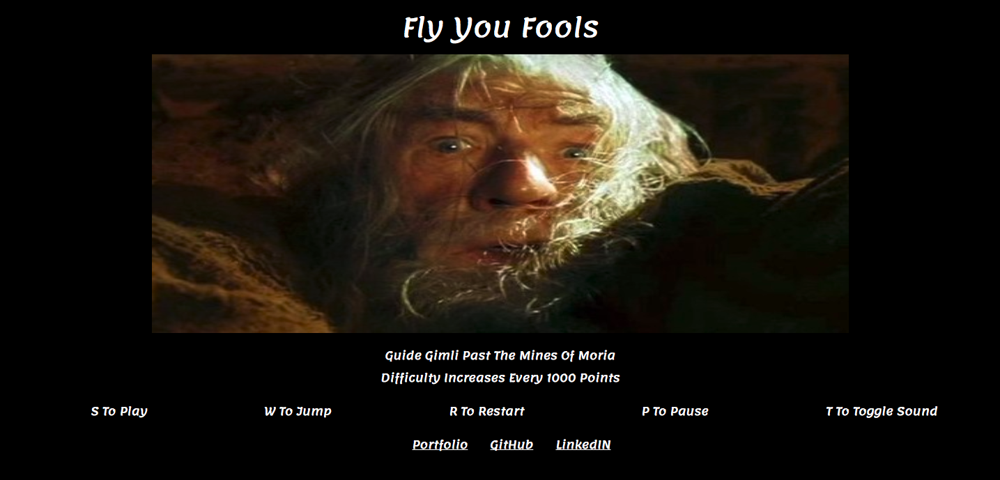

# FlyYouFools

[FlyYouFools Live](http://johnbaek.life/FlyYouFools)

# What is FlyYouFools?
FlyYouFools is a "Lord Of The Rings" inspired platform runner game which was crafted utilizing Canvas, JavaScript, jQuery, HTML, and CSS.
The game also makes use of Google's Firebase in order to keep track of scores from players all over the world.

# How do you play FlyYouFools?

After the user initializes the game by entering their name and hitting the "S" key to start the game, the user must then use the "W" key to make Gimli jump and land on the passing platforms. The longer Gimli stays alive, the higher a user's score. Watch out though! Gimli has only one life and the speed of the platforms increases every 1000 points.
Additional capabilities include pressing "T" to toggle the soundtrack, "R" to restart the game on game over, and "P" key to pause the game.
Top scores can be seen once the game is over. Happy playing!
